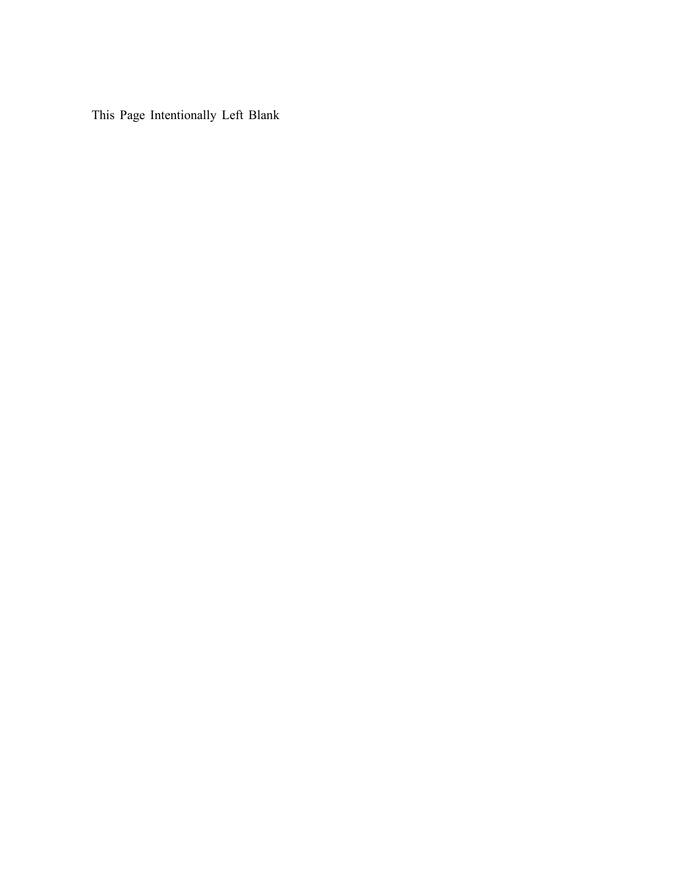

# Intentionally Left Blank

The page in the picture above is 99.88593426672175% white(/blank).

    $ python3 empty.py
    99.88593426672175

So, it should say "intentionally left 99.88593426672175% white" instead.

Then again even if it did so it still would be wrong because blank space would decrease even more due to those extra characters added.

**The Realest Question:** Is it even possible to have such notices with actual blank space percentage with exact precision for a given *W*-by-*H* pixel page?

# Next?

* Blank page generator with accurate blank space percentage
